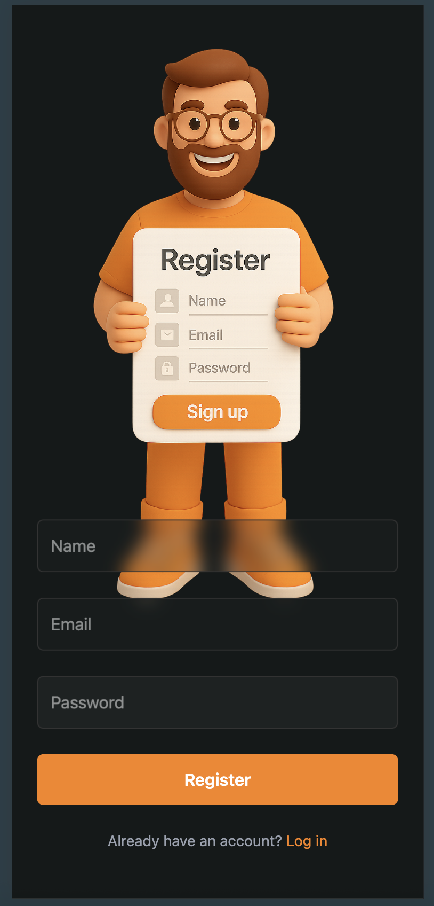
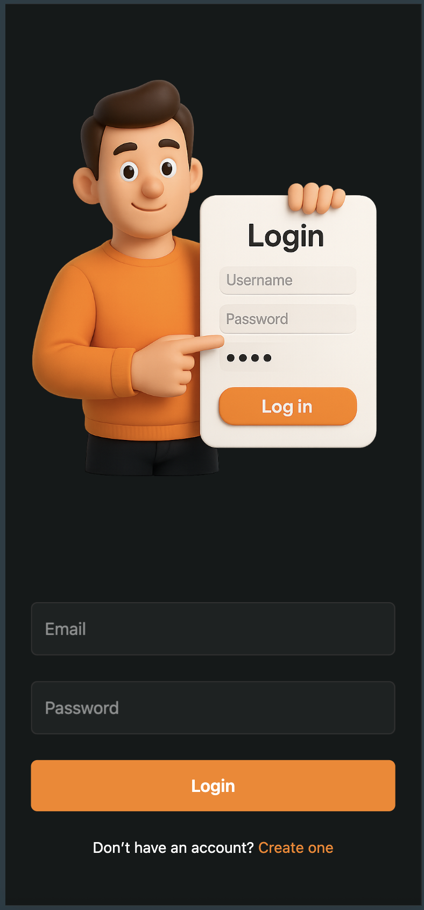
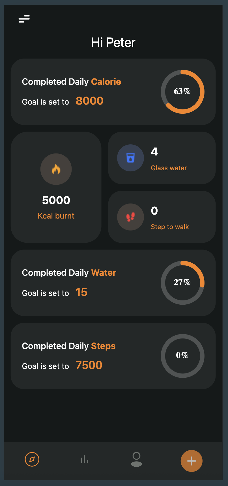
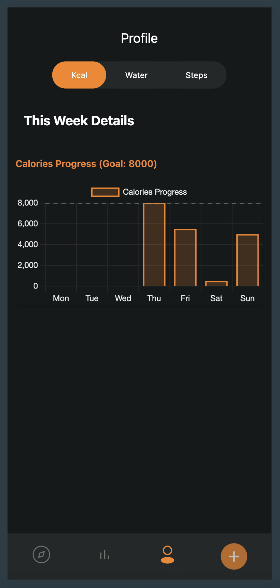
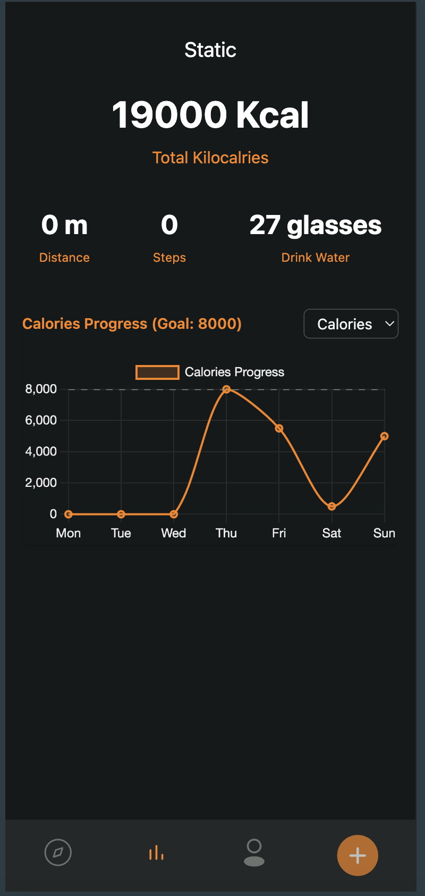
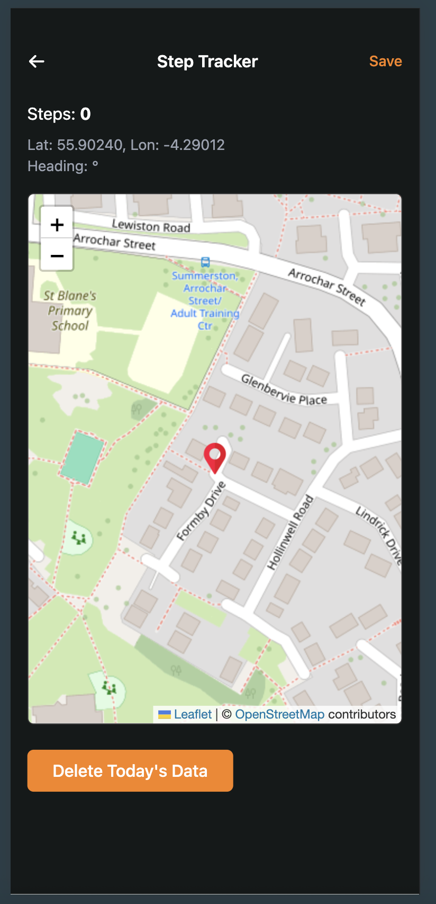
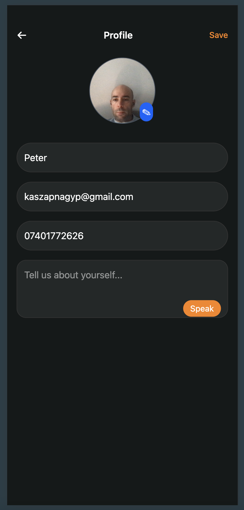
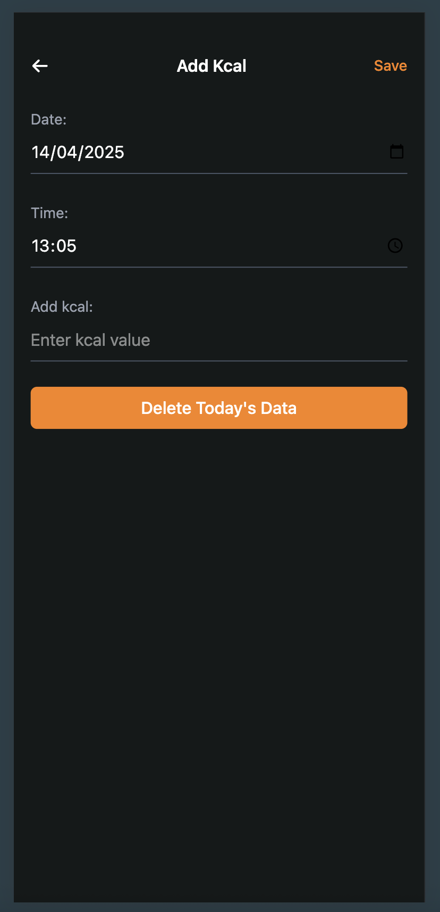
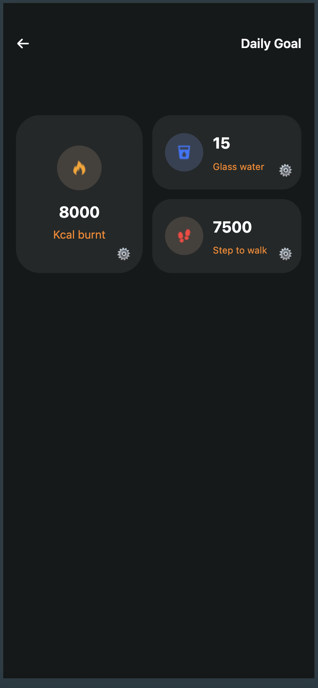
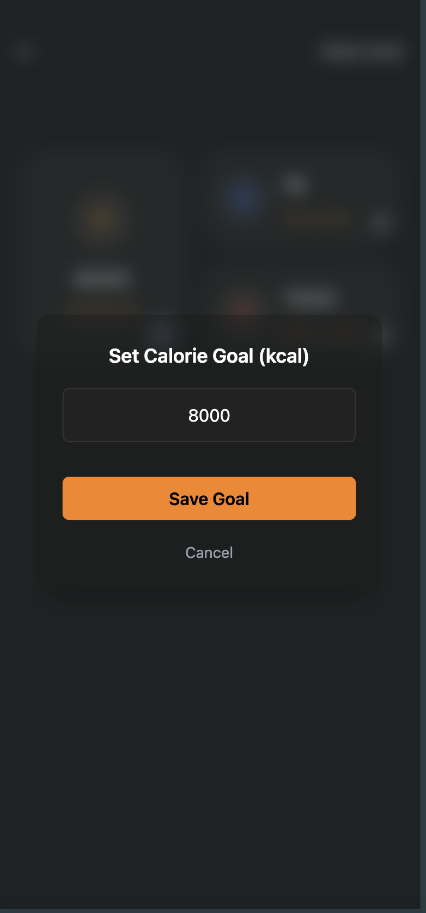

# Healthy Habit Tracker

## Table of Contents

- [Project Description](#project-description)
- [Features](#features)
- [Technologies Used](#technologies-used)
- [Installation](#installation)
  - [Prerequisites](#prerequisites)
  - [Setup Steps](#setup-steps)
- [Usage Instructions](#usage-instructions)
  - [PWA Installation](#pwa-installation)
  - [Application Walkthrough](#application-walkthrough)
- [Project Structure](#project-structure)
- [Database Schema](#database-schema)
- [Hardware API Usage](#hardware-api-usage)
- [Routing](#routing)
- [Screenshots](#screenshots)
- [License](#license)
- [Author](#author)

## Project Description

The Healthy Habit Tracker is a mobile-first web application built with React to help users manage their daily routines, specifically focusing on:

- Hydration tracking
- Step tracking
- Calorie intake management

## Features

The application includes the following key features:

- User Authentication (Login/Registration)
- Habit tracking (hydration, calories, steps) with progress visualization
- User profiles with data storage and customizable goals
- Microphone-based text input (speech-to-text) for profile editing
- Step tracking using device motion sensors and GPS map view
- Camera access for profile photo capture
- Vibration feedback for user interaction
- Detailed weekly history charts & statistics views

## Technologies Used

The application is built using the following technologies:

- React
- Vite
- Dexie.js
- React Router (react-router-dom)
- Web APIs (Camera, Microphone, Geolocation, Vibration, Device Motion/Orientation)
- Tailwind CSS
- Chart.js (for charts)
- Leaflet (for maps)

## Installation

### Prerequisites

Before you begin, ensure you have the following installed on your system:

- **Git:** Required for cloning the repository.
- **Node.js:** Required for running the project and managing dependencies. Version 18.x or later is recommended. (npm is typically included with Node.js).

### Setup Steps

To run the application locally for development, follow these steps:

1.  **Clone the repository:**
    ```bash
    git clone [https://github.com/luciferpeter88/pwa.git](https://github.com/luciferpeter88/pwa.git)
    ```
2.  **Navigate to the project directory:**
    ```bash
    cd pwa
    ```
3.  **Install dependencies:**
    ```bash
    npm install
    ```
4.  **Start the development server:**
    ```bash
    npm run dev
    ```
    The application will then be accessible at the address provided in the terminal (typically http://localhost:5173).

## Usage Instructions

### PWA Installation

1.  **Visit the Website:** Open a compatible web browser on your phone or desktop and go to the application URL: https://habbit-tracker-zeta.vercel.app/
2.  **Install Prompt:** Your browser may automatically offer an option to install the app or add it to your home screen (via a pop-up or address bar icon).
3.  **Confirm Installation:** Follow the browser's prompt to install the PWA. **The app will then be added to your device like a native application, available to launch directly from your home screen or app list.**

### Application Walkthrough

Once installed (or when using the app directly in the browser):

1.  **Registration Screen**

    - 
    - New users can sign up here.
    - Requires: Name, Email, Password.

2.  **Login Screen**

    - 
    - Existing users can log in.
    - Requires: Email, Password.

3.  **Dashboard – Overview Screen**

    - 
    - This is your main summary screen after login.
    - Shows daily progress for:
      - Daily Calories
      - Daily Water Intake
      - Daily Steps
    - Each section includes:
      - A goal value (e.g., 8000 kcal, 15 glasses, 7500 steps)
      - A circular progress ring showing completion percentage
      - The current value logged for the day
    - Tap the sections to view detailed progress or adjust your goals.

4.  **Profile – Detailed Weekly History**

    - 
    - This view shows your historical progress week by week.
    - Use the top **tabs** to switch between Kcal, Water, and Steps.
    - Below the tabs, a chart shows your weekly progress for the selected metric. Great for visualizing trends over time.

5.  **Statistics – Total Progress and Weekly Charts**

    - 
    - This screen provides overall statistics and a weekly view, differing from the Profile history view.
    - At the top: Shows **total cumulative** progress (Total kilocalories burned, Total water consumed, Total distance and steps).
    - Use the **dropdown menu** to choose between Calories, Water, or Steps for the weekly chart below.
    - A line chart shows daily stats for the current week based on the dropdown selection.

6.  **Step Tracker – GPS Map View**

    - 
    - Tracks your steps and location using GPS.
    - Displays: Steps counted for the day, your live latitude and longitude, heading direction (if available).
    - Shows your position on a map using OpenStreetMap (Leaflet).
    - Includes a "Delete Today’s Data" button to clear today’s step count.

7.  **Edit Profile Page**

    - 
    - Here you can personalize your profile.
    - Upload or take a profile picture.
    - Edit your: Name, Email, Phone number.
    - Use the "Speak" button to fill the "About" field via speech-to-text.
    - Tap Save to confirm your changes.

8.  **Add Kcal Page**

    - 
    - Log your calorie data manually.
    - Select the date and time.
    - Enter the amount of kilocalories to log.
    - Use the Save button to store the entry.
    - Tap Delete Today’s Data to remove today’s kcal record.

9.  **Daily Goal Settings Page**

    - 
    - Customize your daily goals.
    - You can set a goal for: Calories burned, Water glasses, Steps.
    - Tap the ⚙️ gear icon beside any category to open the goal-setting modal.

10. **Goal Setting Modal**
    - 
    - This modal appears when you want to change a goal.
    - Enter a new value (e.g., 8000 kcal).
    - Tap Save Goal to apply the change, or tap Cancel to dismiss.

## Project Structure

The project source code (`src/`) is organized as follows:

- **`src/components/`**: Contains global, reusable UI components used across multiple screens (e.g., navigation bars, buttons).
- **`src/hooks/`**: Contains custom React hooks encapsulating reusable logic (e.g., `useCapturePicture`, `useDeviceMotion`, `useSpeechToText`).
- **`src/screens/`**: Contains components representing distinct application screens or pages. Each screen typically resides in its own subfolder, which may also contain a nested `components/` folder for UI elements specific only to that screen.
- **`src/utils/`**: Contains utility functions, helper scripts, and configuration files that are not React components (e.g., `db.js` for Dexie setup, `auth.js`).
- **`src/assets/`**: Contains static assets like images, icons, etc. (Note: This folder might be outside `src` depending on setup, e.g., in `public/`).

## Database Schema

The application uses IndexedDB (via the Dexie.js library) for client-side data storage. The database schema in `utils/db.js` includes the following tables:

- `users`: Stores user information (id, name, email, password).
- `calories`: Stores calorie intake data (id, userID, date, calories).
- `water`: Stores water intake data (id, userID, date).
- `steps`: Stores step count data (id, userID, date).
- `dailyGoals`: Stores user's daily goals (id, userID, date).

## Hardware API Usage

The application utilizes the following device hardware APIs:

- **Camera API:** Used to capture user profile photos.
- **Microphone API (SpeechRecognition):** Used to enable voice-based text input.
- **Geolocation API:** Used to access the user's location, potentially for step tracking or other location-based features.
- **Vibration API:** Used to provide haptic feedback to the user for certain actions or events.
- **Device Motion API:** Used to detect device movement, primarily for step tracking functionality.
- **Device Orientation API:** Used to determine the direction the device is heading.

## Routing

The application uses React Router (`react-router-dom`) for navigation. The main routing structure is defined using a `<Router>` component, with individual routes defined within a `<Routes>` component. Each `<Route>` maps a specific URL path to a corresponding screen component. Some routes are organized within a layout component (like the /profile route), sharing common UI elements.

## License

MIT License

## Author

Peter Kaszap-Nagy
